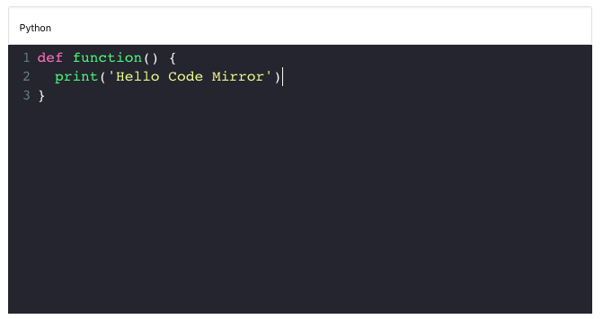

# CodeMirror Tool for Editor.js

Code Mirror for the [Editor.js](https://ifmo.su/editor) allows to include code examples in your articles.



## Know Bugs

* On focus, when cursor is blinking, the ediitor always activate event  'OnChange'.

## Installation

### Install via NPM

**TODO:**

###  Download to your project's source dir

1. Upload folder `dist` from repository
2. Add `dist/bundle.js` file to your page.

### Load from source

Require this script on a page with Editor.js.

```html
<script src="..."></script>
```

## Usage

Add a new Tool to the `tools` property of the Editor.js initial config.

```javascript
var editor = EditorJS({
  ...
  
  tools: {
    ...
    code: CodeMirror,
  }
  
  ...
});
```

## Config Params

| Field       | Type     | Description                    |
| ----------- | -------- | -------------------------------|
| placeholder | `string` | Code Tool's placeholder string |

## Output data

This Tool returns code.

```json
{
    "type" : "code",
    "data" : {
        "code": "body {\n font-size: 14px;\n line-height: 16px;\n}",
    }
}
```

